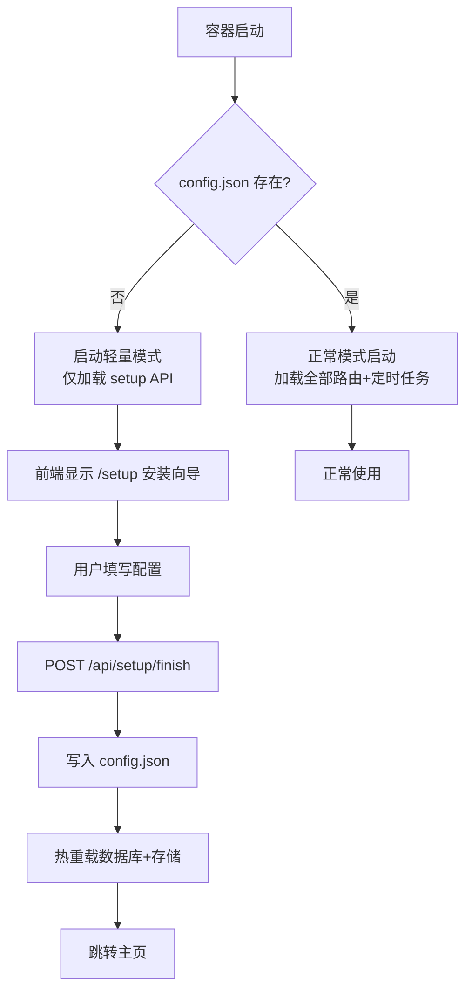

## Product Overview

将隧隧虫改造为可推送至 Docker Hub 的单镜像应用，支持私有化部署（pull 即用）。首次启动时提供 Web 安装向导页面，用户通过浏览器完成数据库和存储配置，配置完成后自动进入正常业务页面。镜像需做到小而精，用户上手零成本。

## Core Features

- **单容器部署**：一个 Docker 镜像包含前端+后端，`docker run -p 80:80 -v data:/app/data suisuichong` 即可启动
- **首次启动安装向导**：无配置文件时自动进入 `/setup` 安装页面
- 数据库选择：SQLite（默认，数据存在容器内 `/app/data/`）或 MySQL（填写连接信息）
- 存储选择：容器内部存储（默认）或 MinIO/阿里云 OSS/腾讯云 COS（填写凭证）
- **配置持久化**：安装向导完成后生成 `/app/data/config.json`，挂载 volume 后重启不丢失
- **健康检查**：`/api/health` 返回服务状态和是否已初始化
- **镜像优化**：拆分依赖为 base + 可选存储 SDK，默认镜像约 150MB

## Tech Stack

- 现有：Vue 3 + TypeScript + Vite + Element Plus + TailwindCSS（前端）；Python FastAPI + SQLAlchemy（后端）
- 新增：SQLite 作为默认数据库（Python 内置，无需额外依赖）
- 持久化：JSON 配置文件（`/app/data/config.json`）

## Implementation Approach

### 核心架构改造

**"首次运行检测"机制**：后端启动时检查 `/app/data/config.json` 是否存在。不存在则标记 `initialized=false`，前端通过 `/api/setup/status` 接口感知状态，自动路由到 `/setup` 安装向导。安装完成后写入配置文件，后端重新初始化数据库和存储，切换到正常模式。



### 关键技术决策

1. **延迟初始化**：当前 `main.py` 模块级 `storage = get_storage()` 和 `transfer_service.py` 模块级 `storage = get_storage()` 在 import 时就执行。改为在 lifespan 内按需初始化，`database.py` 的 engine/SessionLocal 也改为延迟创建（通过 `init_database()` 函数）。

2. **配置管理改造**：新增 `server/setup_config.py` 管理安装向导的配置读写。`config.py` 的 Settings 增加通过 JSON 文件加载配置的能力（pydantic-settings 支持 `json_file`）。

3. **SQLite 兼容**：

- `config.py` 的 `db_url` property：`DB_TYPE=sqlite` 时返回 `sqlite:////app/data/suisuichong.db`
- `database.py` 的 `create_engine`：SQLite 时移除 `pool_recycle`/`pool_pre_ping`，添加 `check_same_thread=False`
- `requirements.txt`：`pymysql` 和 `cryptography` 移到 `requirements-mysql.txt`

4. **Docker 镜像分层**：

- 基础镜像（默认）：`python:3.11-slim` + nginx + base Python 依赖（无三方存储 SDK、无 pymysql），约 150MB
- 构建优化：前端 `package*.json` 先 COPY 安装依赖（层缓存），npm 用 `ci` 代替 `install`
- 添加 `.dockerignore` 排除 `node_modules`、`.git`、`__pycache__` 等

5. **安装向导 API**（新路由 `server/routes/setup.py`）：

- `GET /api/setup/status` → `{ initialized: bool }`
- `POST /api/setup/test-db` → 测试数据库连接
- `POST /api/setup/test-storage` → 测试存储连通性
- `POST /api/setup/finish` → 写入配置文件 + 初始化数据库

6. **前端安装向导**（新页面 `client/src/views/SetupView.vue`）：

- 路由守卫：未初始化时所有路由重定向到 `/setup`
- 安装页面分两步：Step 1 数据库配置 → Step 2 存储配置
- 使用 Element Plus 的 el-step + el-form 组件

## Architecture Design

```mermaid
flowchart LR
    subgraph Frontend
        Router[路由守卫]
        Setup[/setup 安装向导]
        Home[/ 主页]
        Retrieve[/retrieve 提取]
    end

    subgraph Backend
        SetupAPI[setup.py<br>安装配置API]
        TransferAPI[transfer.py<br>业务API]
        Config[config.py + setup_config.py<br>配置管理]
        DB[(database.py<br>SQLite/MySQL)]
        Storage[storage/__init__.py<br>存储工厂]
    end

    subgraph Data
        JSON[config.json]
        SQLite[(suisuichong.db)]
        Files[uploads/]
    end

    Router -->|未初始化| Setup
    Router -->|已初始化| Home
    Router -->|已初始化| Retrieve
    Setup --> SetupAPI
    Home --> TransferAPI
    Retrieve --> TransferAPI
    SetupAPI --> Config
    TransferAPI --> DB
    TransferAPI --> Storage
    Config --> JSON
    DB --> SQLite
    Storage --> Files
```

## Directory Structure

```
/Users/lwang/myproject/suisui/
├── .dockerignore                          # [NEW] Docker 构建排除文件
├── server/
│   ├── config.py                          # [MODIFY] 支持 SQLite，支持 json_file 加载
│   ├── database.py                        # [MODIFY] 延迟初始化 engine，兼容 SQLite
│   ├── main.py                            # [MODIFY] 延迟初始化 storage，条件注册路由
│   ├── setup_config.py                    # [NEW] 安装向导配置读写模块
│   ├── routes/
│   │   ├── transfer.py                    # [保持不变]
│   │   └── setup.py                       # [NEW] 安装向导 API（4个端点）
│   ├── services/
│   │   ├── transfer_service.py            # [MODIFY] storage 改为延迟获取
│   │   └── storage/
│   │       └── __init__.py                # [MODIFY] 保持现有逻辑不变
│   ├── requirements.txt                   # [MODIFY] 移除 pymysql/cryptography/云SDK
│   └── requirements-mysql.txt             # [NEW] MySQL 可选依赖
├── client/
│   ├── src/
│   │   ├── router/index.ts               # [MODIFY] 添加 /setup 路由 + 导航守卫
│   │   ├── api/index.ts                   # [MODIFY] 添加 setup API 调用
│   │   ├── views/
│   │   │   ├── HomeView.vue              # [保持不变]
│   │   │   ├── RetrieveView.vue          # [保持不变]
│   │   │   └── SetupView.vue             # [NEW] 安装配置向导页面
│   │   └── App.vue                       # [保持不变]
│   └── ...
├── docker/
│   ├── Dockerfile                         # [MODIFY] 分层依赖 + 构建优化
│   ├── entrypoint.sh                      # [MODIFY] 移除 MySQL 等待，改为检查 config.json
│   └── nginx.conf                         # [保持不变]
├── docker-compose.yml                     # [MODIFY] 简化为单服务
└── README.md                              # [MODIFY] 更新部署说明
```

## Implementation Notes

- `transfer_service.py` 第 8 行 `storage = get_storage()` 模块级调用必须移到函数内改为延迟获取，否则配置写入前就会初始化错误的后端
- `main.py` 第 10 行同理，storage 实例化移到 lifespan 内部
- `database.py` 的 engine 必须延迟创建（不能在模块 import 时），因为 db_url 依赖 config.json 中的 DB_TYPE
- SQLite 不支持 `pool_recycle` 和 `pool_pre_ping`，create_engine 参数需按 DB_TYPE 条件化
- `server_default=func.now()` 在 SQLite 下会存储为 UTC 文本字符串，但对业务逻辑无影响（都是 Python datetime 比较）
- 前端安装向导使用项目现有的 Element Plus + TailwindCSS + brand-xxx 样式类，保持设计一致性
- config.json 使用 JSON 格式而非 .env，因为需要支持 Web API 动态写入
- `/api/setup/*` 路由在已初始化后应返回 403，防止配置被篡改

## Design Style

安装向导页面采用与现有隧隧虫一致的自然有机设计风格，使用相同的品牌色系和组件样式。两步式向导，每步一个卡片，清晰引导用户完成配置。

## Page Design

### SetupView - 安装配置向导

**布局**：居中单列布局，max-w-2xl，与 HomeView 一致的卡片风格

**Block 1: Header**

- 品牌虫子图标 + "欢迎使用隧隧虫" 标题 + "首次使用，请完成以下配置" 副标题
- 与 HomeView Hero Section 风格一致但更紧凑

**Block 2: Step Indicator**

- 使用 Element Plus el-steps 组件，两步：数据库配置 → 存储配置
- 品牌绿色激活态，步骤之间清晰的进度指示

**Block 3: Step 1 - 数据库配置**

- el-radio-group 选择：SQLite（推荐） / MySQL
- SQLite 选中时：显示简短说明 "数据存储在容器内部，无需额外配置"
- MySQL 选中时：展开表单，字段包含主机、端口、用户名、密码、数据库名
- 底部"测试连接"按钮 + 连接状态反馈（成功/失败提示）
- "下一步"主按钮

**Block 4: Step 2 - 存储配置**

- el-radio-group 选择：容器内部存储（推荐） / MinIO / 阿里云 OSS / 腾讯云 COS
- 选中容器内部时：显示简短说明 "文件存储在容器内部"
- 选中三方存储时：展开对应凭证表单
- 底部"测试连接"按钮 + 连通性反馈
- "完成安装"主按钮（品牌绿色渐变）

**Block 5: Loading/Success**

- 提交后显示全屏加载遮罩 + "正在初始化..."
- 成功后显示成功提示，3 秒后自动跳转到主页

所有输入框使用 brand-input 样式类，按钮使用 brand-btn-primary，卡片使用 brand-card，与现有页面完全一致。

## Agent Extensions

### Skill

- **element-plus-vue3**
- Purpose: 安装向导页面使用 Element Plus 的 el-steps、el-form、el-radio-group 等组件构建配置表单
- Expected outcome: 生成符合 Element Plus Vue 3 最佳实践的表单组件代码