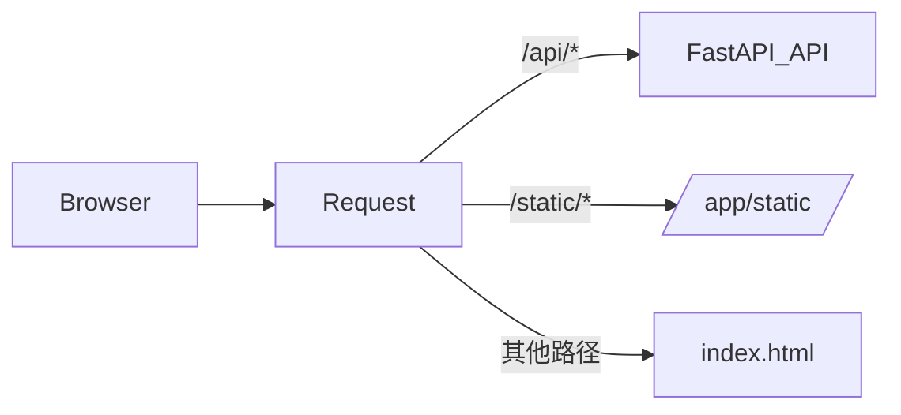

## 用户需求

去掉 Docker 镜像中的 Nginx，改为纯 Uvicorn 方案（FastAPI 直接 serve 前端静态文件），应用默认 Web 端口改为 7895，然后构建镜像并启动容器。

## 产品概述

简化 Docker 镜像架构：移除 Nginx 依赖，由 FastAPI 统一处理 API 请求和前端静态文件服务。单进程、单端口架构更简洁，镜像更小。

## 核心功能

- FastAPI StaticFiles 挂载前端 dist 产物，serve 静态资源
- SPA catch-all 路由（所有未匹配 API 路径返回 index.html）
- 端口统一为 7895
- 文件上传大小限制迁移到 Uvicorn 启动参数
- 构建镜像并用 docker compose 启动容器

## 技术方案

### 架构变更

移除 Nginx，由 Uvicorn 单进程同时处理前端静态文件和后端 API。前端产物 dist 复制到 `/app/static`，FastAPI 挂载 `StaticFiles` 到 `/static`，并在所有路由之后注册 SPA catch-all 返回 `index.html`。

### SPA 回退关键实现

- `StaticFiles` 挂载 `/static` → 读取 `/app/static` 目录下的 js/css/图片等静态资源
- Catch-all 路由 `/{path:path}` 放在所有 API 路由之后，返回 `/app/static/index.html`
- 前端 vite 构建时 `base` 路径需设为 `/static/`，确保静态资源引用路径正确

### 文件上传大小限制

Nginx 原来的 `client_max_body_size 60M` 改为 Uvicorn 启动参数 `--timeout-keep-alive 120`，FastAPI 层面的 `MAX_FILE_SIZE_MB` 校验已存在，无需额外改动。

### 端口变更

- Dockerfile `EXPOSE 7895`
- entrypoint.sh uvicorn `--port 7895`
- docker-compose.yml `ports: 7895:7895`

## 实现细节

### 目录结构（修改文件）

```
/Users/lwang/myproject/suisui/
├── client/
│   └── vite.config.ts          # [MODIFY] 添加 base: '/static/'
├── server/
│   └── main.py                 # [MODIFY] 添加 StaticFiles 挂载 + SPA catch-all
├── docker/
│   ├── Dockerfile              # [MODIFY] 移除 nginx，前端产物到 /app/static，端口 7895
│   ├── entrypoint.sh           # [MODIFY] 移除 nginx 启动，端口 7895
│   └── nginx.conf              # 保留不删除，但不再被使用
├── docker-compose.yml           # [MODIFY] 端口 7895:7895
└── .dockerignore                # [MODIFY] 无需变更（已排除 client/dist）
```

### 静态文件服务流程

