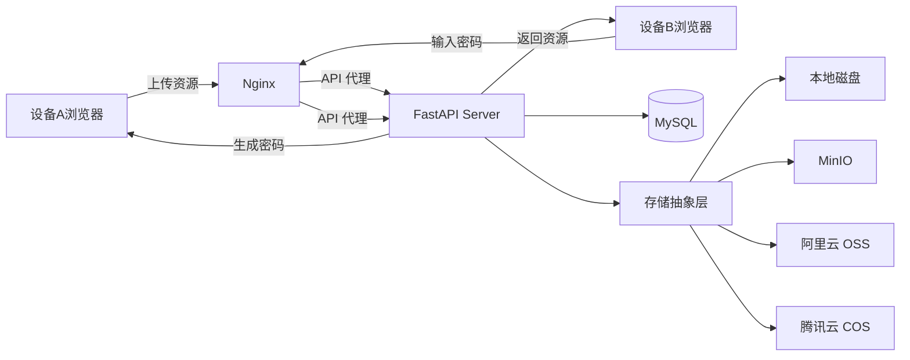

## Product Overview

"隧隧虫" (SuiSuiChong) 是一个跨设备资源传输工具。用户可以在设备 A 上通过浏览器将文本或文件上传至服务器，系统生成一个临时提取密码；用户在设备 B 上通过同一网站输入密码即可提取资源（下载文件或复制文本）。品牌概念源自"虫子钻隧道"的比喻，代表数据在不同设备间快速"钻"过去传输。

## Core Features

- **发送资源**：支持填写纯文本内容或上传文件（支持多文件、拖拽上传），显示上传进度，提交后生成 4 位数字临时密码
- **提取资源**：输入 4 位数字密码，校验密码有效性（是否过期、是否存在），展示资源详情（文本预览 + 文件列表），提供一键复制文本和下载文件功能
- **密码与过期机制**：密码默认有效期 24 小时，4 位数字（10000 种组合），文本资源过期后自动删除，文件资源过期后自动清理存储
- **错误处理**：密码不存在提示"密码无效"，资源已过期提示"资源已过期"，上传失败有明确错误提示
- **文件限制**：单文件最大 50MB，单次传输最多 10 个文件
- **多存储后端**：支持本地磁盘、MinIO、阿里云 OSS、腾讯云 COS，通过环境变量 `STORAGE_TYPE` 切换

## Tech Stack Selection

- **前端**: Vue 3 + TypeScript + Vite + Element Plus (组件库) + Axios (HTTP 请求) + TailwindCSS
- **后端**: Python 3.10+ + FastAPI + Uvicorn (ASGI 服务器)
- **数据存储**: MySQL（Docker Compose 部署 MySQL 容器）
- **文件存储**: 抽象存储层，支持本地磁盘 / MinIO / 阿里云 OSS / 腾讯云 COS（环境变量切换）
- **部署**: Docker Compose 一键部署（FastAPI + Nginx + MySQL 容器）

## Implementation Approach

### 整体策略

采用前后端分离架构，前端 Vue 3 SPA 通过 Axios 与后端 FastAPI REST API 通信。前端打包后由 Nginx 静态托管，Nginx 同时反向代理 API 请求到 FastAPI。使用 MySQL 作为数据存储引擎，文件通过抽象存储层支持多种后端（本地 / MinIO / 阿里云 OSS / 腾讯云 COS）。通过 Docker Compose 一键部署所有服务。

### 关键技术决策

1. **密码方案**: 生成 4 位数字密码（10000 组合），存入 MySQL 带过期时间字段，24h 内可重复提取，加入防爆破机制（同一密码 5 次错误后锁定 1 分钟）
2. **文件存储抽象**: 定义 `StorageBackend` 抽象基类，实现 `LocalStorage`、`MinIOStorage`、`AliOssStorage`、`TencentCosStorage` 四种后端，通过 `STORAGE_TYPE` 环境变量选择
3. **大文件上传**: 50MB 限制下直接上传即可，使用 Element Plus Upload 组件
4. **Docker 部署**: docker-compose.yml 定义 web（FastAPI + Nginx）、db（MySQL）、可选 minio 容器

### 系统架构



### API 设计

| 方法 | 路径 | 功能 |
| --- | --- | --- |
| POST | /api/transfer | 上传文本/文件，创建传输 |
| POST | /api/transfer/verify | 验证密码有效性 |
| GET | /api/transfer/{code} | 获取资源详情 |
| GET | /api/transfer/{code}/download/{filename} | 下载指定文件 |


### 数据模型 (MySQL)

- **transfer** 表: id(auto_increment主键), code(4位数字唯一索引), type(text/file/mixed), text_content(文本内容, LONGTEXT), created_at, expires_at, download_count, fail_count(密码错误次数, 防爆破), locked_until(锁定截止时间)
- **transfer_file** 表: id(auto_increment主键), transfer_code(外键关联transfer.code), original_name(原始文件名), storage_path(存储路径/key), file_size(文件大小字节数), content_type(MIME类型)

### 存储后端配置

通过环境变量 `STORAGE_TYPE` 切换存储后端：

| STORAGE_TYPE | 说明 | 需要的环境变量 |
| --- | --- | --- |
| `local` | 本地磁盘（默认） | `UPLOAD_DIR=./uploads` |
| `minio` | MinIO 对象存储 | `MINIO_ENDPOINT`, `MINIO_ACCESS_KEY`, `MINIO_SECRET_KEY`, `MINIO_BUCKET` |
| `alioss` | 阿里云 OSS | `ALIOSS_ACCESS_KEY_ID`, `ALIOSS_ACCESS_KEY_SECRET`, `ALIOSS_BUCKET`, `ALIOSS_ENDPOINT` |
| `tencentcos` | 腾讯云 COS | `TENCENTCOS_SECRET_ID`, `TENCENTCOS_SECRET_KEY`, `TENCENTCOS_BUCKET`, `TENCENTCOS_REGION` |


## Implementation Notes

- 文件上传使用 `multipart/form-data`，FastAPI 的 `UploadFile` 处理
- 过期资源清理使用 FastAPI startup 事件中清理 + APScheduler 定时任务（每小时执行一次）
- CORS 配置开发环境允许 `localhost:5173`，生产环境由 Nginx 同源代理无需 CORS
- 密码生成需检查唯一性，避免碰撞；4 位数字密码加入防爆破机制（5 次错误后锁定 1 分钟）
- 文件下载：本地存储使用 `FileResponse`，云存储生成预签名 URL 重定向
- 错误响应统一使用 `{detail: "错误信息"}` 格式，前端 Element Plus Message 组件提示
- 存储抽象层统一接口：`upload(code, filename, file)`, `download(code, filename) -> Response`, `delete(code)`, `list_files(code) -> list[FileInfo]`

## Directory Structure

```
/Users/lwang/myproject/suisui/
├── client/                              # [NEW] Vue 3 前端项目 (Vite)
│   ├── index.html
│   ├── package.json
│   ├── vite.config.ts
│   ├── tsconfig.json
│   ├── env.d.ts
│   ├── src/
│   │   ├── main.ts                      # 应用入口，注册 Element Plus
│   │   ├── App.vue                      # 根组件，路由容器
│   │   ├── router/
│   │   │   └── index.ts                 # Vue Router 配置（/ 和 /retrieve 两个路由）
│   │   ├── api/
│   │   │   └── index.ts                 # Axios 封装，API 请求函数
│   │   ├── views/
│   │   │   ├── HomeView.vue             # 发送资源页面（文本输入 + 文件上传 + 生成密码）
│   │   │   └── RetrieveView.vue         # 提取资源页面（密码输入 + 资源展示 + 下载/复制）
│   │   ├── components/
│   │   │   ├── SendText.vue             # 文本发送区域组件
│   │   │   ├── SendFile.vue             # 文件上传区域组件（拖拽+点击）
│   │   │   ├── CodeDisplay.vue          # 密码展示卡片组件
│   │   │   ├── PasswordInput.vue        # 密码输入组件
│   │   │   ├── ResourcePreview.vue      # 资源预览组件（文本预览+文件列表）
│   │   │   └── AppHeader.vue            # 顶部导航栏组件
│   │   └── styles/
│   │       └── global.css               # 全局样式、CSS 变量、品牌主题
│   └── public/
│       └── favicon.svg                  # 品牌图标
├── server/                              # [NEW] Python FastAPI 后端
│   ├── requirements.txt                 # Python 依赖（fastapi, uvicorn, pymysql, oss2, cos-python-sdk-v5, minio, boto3 等）
│   ├── main.py                          # FastAPI 应用入口，路由注册，CORS，启动清理任务
│   ├── database.py                      # MySQL 数据库连接管理（aiomysql / SQLAlchemy）
│   ├── models.py                        # 数据模型定义（Transfer, TransferFile 模型）
│   ├── schemas.py                       # Pydantic 请求/响应 Schema
│   ├── config.py                        # 环境变量配置（数据库、存储类型等）
│   ├── routes/
│   │   └── transfer.py                  # 传输相关 API 路由
│   ├── services/
│   │   ├── transfer_service.py          # 传输业务逻辑（创建、验证、获取、清理、防爆破）
│   │   └── storage/
│   │       ├── __init__.py              # 存储后端工厂函数 get_storage()
│   │       ├── base.py                  # StorageBackend 抽象基类
│   │       ├── local.py                 # 本地磁盘存储实现
│   │       ├── minio_backend.py         # MinIO 存储实现
│   │       ├── alioss.py               # 阿里云 OSS 存储实现
│   │       └── tencentcos.py           # 腾讯云 COS 存储实现
│   └── uploads/                         # 本地文件存储目录（运行时创建）
│       └── .gitkeep
├── docker/                              # [NEW] Docker 部署配置
│   ├── Dockerfile                       # FastAPI + Nginx 多阶段构建镜像
│   ├── nginx.conf                       # Nginx 配置（静态托管 + API 反向代理）
│   └── entrypoint.sh                    # 容器启动脚本（数据库迁移 + 启动服务）
├── docker-compose.yml                   # [NEW] Docker Compose 编排（web + db + 可选 minio）
├── .env.example                        # [NEW] 环境变量模板（数据库、存储配置等）
└── README.md                            # [NEW] 项目说明文档
```

## Key Code Structures

### Pydantic Schema (server/schemas.py)

```python
from pydantic import BaseModel
from typing import Optional
from datetime import datetime

class TransferCreateRequest(BaseModel):
    type: str  # "text", "file", or "mixed"
    text_content: Optional[str] = None

class TransferVerifyRequest(BaseModel):
    code: str  # 4-digit code

class TransferResponse(BaseModel):
    code: str
    type: str  # "text", "file", or "mixed"
    text_content: Optional[str] = None
    files: Optional[list[dict]] = None  # [{name, size, content_type, download_url}]
    created_at: datetime
    expires_at: datetime
    download_count: int
```

### 存储抽象层 (server/services/storage/base.py)

```python
from abc import ABC, abstractmethod
from dataclasses import dataclass

@dataclass
class FileInfo:
    name: str
    size: int
    content_type: str

class StorageBackend(ABC):
    @abstractmethod
    async def upload(self, code: str, filename: str, file) -> str:
        """上传文件，返回存储路径"""

    @abstractmethod
    async def download(self, code: str, filename: str):
        """下载文件，返回流式响应内容"""

    @abstractmethod
    async def get_download_url(self, code: str, filename: str) -> str:
        """获取下载 URL（本地存储返回 API 路径，云存储返回预签名 URL）"""

    @abstractmethod
    async def delete(self, code: str):
        """删除指定 code 下的所有文件"""

    @abstractmethod
    async def list_files(self, code: str) -> list[FileInfo]:
        """列出指定 code 下的所有文件"""
```

## Design Style

采用**有机自然风格 (Organic/Natural)** 设计，呼应"隧隧虫"品牌概念。整体色调以大地色系为基底（暖绿、棕色、米白），搭配圆润的形态和微妙的有机纹理，营造"虫子在泥土隧道中穿行"的视觉隐喻。

- **视觉记忆点**: 品牌色采用森林绿 (#2D6A4F) 配合暖土橙 (#E76F51) 作为强调色，背景使用柔和的渐变，模拟泥土到草地的层次感
- **动效设计**: 页面加载时品牌 Logo 有"钻出隧道"的动画；密码生成时有数字滚动效果；文件上传时有进度虫蠕动动画；密码输入框有逐位输入的打字机效果
- **布局特点**: 居中单栏布局，卡片式设计带圆润边角和柔和阴影，留白充足，层次分明

## Page Planning

共 3 个页面/视图：

1. **发送页面 (/)** - 用户填写文本或上传文件，生成提取密码
2. **提取页面 (/retrieve)** - 用户输入密码获取资源
3. **密码展示弹窗** - 生成密码后的全屏/模态展示

## Page Block Design

### 发送页面

- **顶部导航栏**: 品牌名"隧隧虫"居左，右侧"提取资源"按钮跳转 /retrieve
- **品牌 Hero 区**: 大标题"跨设备，传什么都可以"，副标题简述功能，背景有微妙的有机纹理
- **内容输入区**: Tab 切换"文本"和"文件"两种模式。文本模式为 ElInput textarea；文件模式为 ElUpload 拖拽区域，带文件类型/大小提示
- **操作区**: "生成密码"按钮，点击后展示密码展示弹窗

### 提取页面

- **顶部导航栏**: 与发送页一致
- **密码输入区**: 居中展示，4 位数字输入框（或单个密码输入框），"提取"按钮
- **资源预览区**: 提取成功后展示。文本类型显示预览 + 复制按钮；文件类型显示文件名列表 + 下载按钮
- **过期/错误提示**: 密码无效或资源过期时显示友好提示，带"返回重试"按钮

### 密码展示弹窗

- **密码大字展示**: 4 位数字大号字体，支持一键复制
- **有效期提示**: 显示"密码将在 24 小时后过期"
- **分享引导**: "将密码发送给接收方"提示文字，"完成"按钮关闭

## Agent Extensions

### Skill

- **element-plus-vue3**
- Purpose: 指导 Vue 3 + Element Plus 组件的正确使用方式，包括表单、上传、对话框、消息提示等组件的最佳实践
- Expected outcome: 产出符合 Element Plus 规范的高质量 Vue 3 组件代码
- **前端开发**
- Purpose: 提供全栈前端开发能力，包括 UI 设计实现、动画效果、品牌视觉呈现
- Expected outcome: 实现美观的品牌化 UI 界面，包括品牌动画、微交互效果
- **frontend-design**
- Purpose: 确保前端界面具有独特的视觉风格，避免通用 AI 美学，打造有品牌辨识度的设计
- Expected outcome: 产出独特的有机自然风格设计，具有"隧隧虫"品牌特色